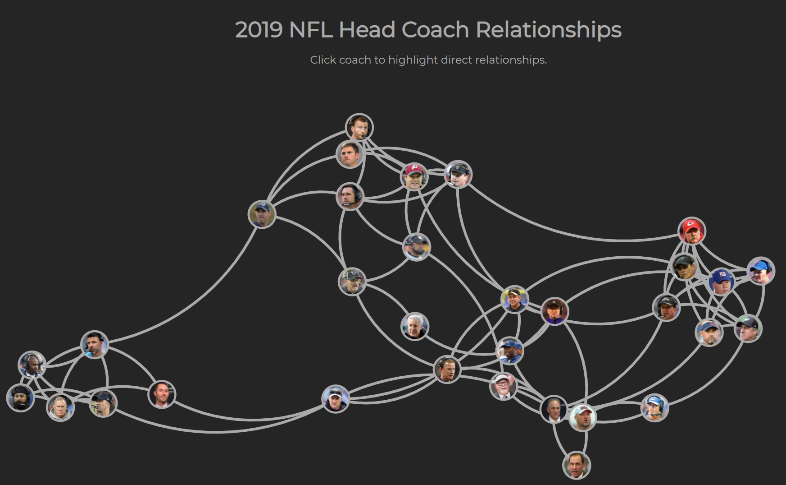

Note: Source Code is <a href="https://github.com/jmsims2/nfl-coach-network-vis" target="_blank">here</a>. End result is <a href="https://nfl-coach-network-viz.now.sh/" target="_blank">here</a>.

I've been wanting to play around with network visualizations for awhile now. A few weeks ago, I was browsing some of Mike Bostock's work (the creator of d3.js) and came across <a href="https://archive.nytimes.com/www.nytimes.com/interactive/2013/02/20/movies/among-the-oscar-contenders-a-host-of-connections.html" target="_blank">this</a> visualization from the New York Times. It's gorgeous. Not only does it look beautiful, but the interactions when hovering over a node or a link are perfect. So I decided to give it a try myself.

I wanted to visualize relationships between current NFL Head Coaches. To get my data set, I leaned on wikipedia to get each coaches playing and coaching history by year. I also assumed that Brian Flores and Zac Carter will be named the head coaches of the Miami Dolphins and Cincinnati Bengals, respectively.

Once I had my <a href="https://github.com/jmsims2/nfl-coach-network-vis/blob/master/coaches.json" target="_blank">data</a> compiled, I wrote a little node.js script to take it from an array of objects representing a single year in a coaches career to an object of nodes and links. That script can be found <a href="https://github.com/jmsims2/nfl-coach-network-vis/blob/master/setupData.js" target="_blank">here</a>.

Now that I had my data ready, it was time to start playing with the network visualization. I leveraged d3.js and found a few tutorials to help guide me along the way. Believe it or not, getting the network visualization to show up on the screen was not the hardest part. The hardest part, by far, was figuring out how to get an image as a background for an svg element. For that, I used patterns defined in the svg since it's not as simple as a css rule. That said, patterns seem to be way more powerful so I'm excited to play with them some more. The result of my hacking so far is below. I have a few things left that I'd like to do. First, I want to add some animation when hovering over nodes and links, like in the NYTimes visualization. Second, I want to see what the relationships would look like if I add some former coaches who may have more relationships, such as Bill Parcells or Bill Cowher among many others. In addition, I'd like to better visualize the links. A link from Matt Patricia to Bill Belichick is much stronger than a link from Belichick to Kliff Kingsbury, as an example. Patricia and Belichick worked together for 13 or so seasons and Kingsbury "played" a few games for Belichick. To see the completed product, go to <a href="https://nfl-coach-network-viz.now.sh/" target="_blank">https://nfl-coach-network-viz.now.sh/</a>.

So what does this visualization tell us? It's generally what you would expect. The lower left corner is the Patriots corner where you have 5 Head Coaches directly linked to Bill Belichick (I'm being generous with Kliff Kingsbury). On the right side, you have the Andy Reid area. The middle is interesting because Mike Tomlin and Kyle Shanahan both have quite a few relationships with current head coaches, which I didn't expect before seeing it.

